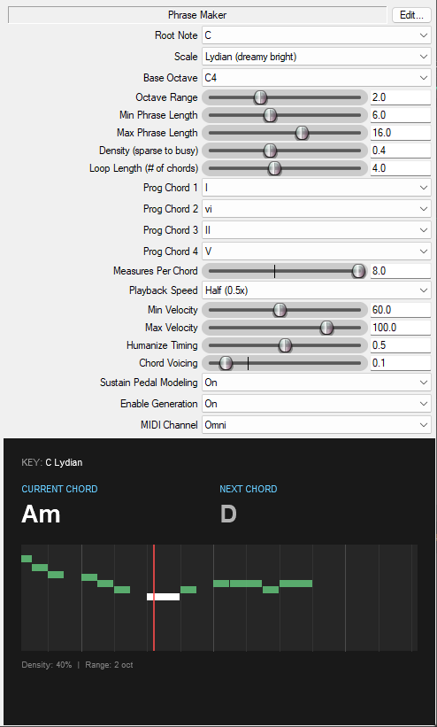

# Saurav Plays Piano JSFX

A collection of custom JSFX plugins for **Reaper**, designed and developed by [Saurav Plays Piano](https://sauravplayspiano.com).

This is a collection of Reaper plugins I wrote to help me with some of my ambient / neo-classical piano productions. I am releasing them as open-source for other Reaper users to explore, modify, and use in their own creative work.

> ⚠️ **Note:** This repository is currently in **Alpha**. The code is experimental, parameters may change. Use with caution in critical projects.

## Installation

### Option 1: ReaPack (Recommended)

1. In Reaper, go to **Extensions → ReaPack → Import repositories...**
2. Paste this URL (raw index):

  ```
https://github.com/SauravSengupta/saurav-plays-piano-jsfx/raw/refs/heads/main/index.xml
  ```

3. Click OK and ReaPack will download the latest versions automatically.
4. Browse available plugins via **Extensions → ReaPack → Browse packages**

### Option 2: Manual Install

1. Download this repository (Code → Download ZIP).

2. Extract the files to your Reaper Effects folder:
   * **Windows:** `%AppData%\REAPER\Effects\SauravPlaysPiano`
   * **Mac:** `~/Library/Application Support/REAPER/Effects/SauravPlaysPiano`

3. Restart Reaper or run "Scan for new plugins."

## The Tools

### MIDI Note Dropper

**[midi-note-dropper.jsfx](jsfx/midi-note-dropper.jsfx)**

A simple tool that probabilistically drops incoming MIDI note-on events. Think of it as a "MIDI gate" based on random chance rather than velocity or other parameters.

#### Parameters

- **Chance to Play %** (0-100): Percentage chance that each note-on event will be allowed through
  - `100%` = all notes pass (no effect)
  - `50%` = roughly half the notes are randomly dropped
  - `0%` = all notes are blocked

#### Use Cases

- **Thin dense patterns**: Take a busy arpeggio or sequence and randomly thin it out for a less mechanical feel
- **Create space**: Drop notes from sustained chords to create movement and breathing room
- **Generative rhythms**: Feed in a steady stream of notes and let randomness create interesting rhythmic patterns
- **Ambient textures**: Combine with delay/reverb to create unpredictable, evolving soundscapes
- **Live improvisation**: Add controlled chaos to your playing

#### Technical Notes

- Only affects MIDI note-on messages (status `0x90` with velocity > 0)
- All other MIDI data passes through unchanged (note-offs, CC, pitch bend, etc.)
- Uses per-note randomization, so results vary with each playback
- Works on all MIDI channels

---

### Phrase Maker

**[phrase-maker.jsfx](jsfx/phrase-maker.jsfx)**

A generative phrase engine that tries to create melodic phrases based on simple musical theory. It understands scales and chords, and tries to generate natural-sounding melodies that follow a chord progression. It features a **real-time piano roll visualization** and a basic built-in **chord progression sequencer**.

If music theory isn't your strong suit, you may find this helpful to create something that can serve as a starting point that you can then build on. I mostly use this to record a long track, listen to the generated phrases, and then pick some to work on further.

#### Limitations

- It still mostly sounds like computer generated music, and probably always will

#### Parameters

**Musical Settings**

- **Root Note** (C-B): The root of the musical key (all melodies stay within this key)
- **Scale** (Major / Minor / Dorian): Choose the tonal character
  - *Major*: Bright, happy, traditional
  - *Minor*: Dark, sad, introspective
  - *Dorian*: Jazzy, bittersweet, modal

**Range Settings**

- **Base Octave** (C1-C6): The starting octave for phrase generation
- **Octave Range** (1-4): How many octaves the melody can span above the base octave

**Phrase Settings**

- **Min Phrase Length** (2-8): Shortest phrase length in notes
- **Max Phrase Length** (3-20): Longest phrase length in notes

**Progression Sequencer**

- **Loop Length** (1-8): Number of chords in the loop
- **Prog Chords 1-4** (I-vi): Define your chord progression
- **Measures Per Chord** (1-8): Duration of each chord
- **Continuous Mode** (Off/On): When enabled, minimizes rests between phrases for a continuous flow
- **Playback Speed** (0.5x - 8x): Scales the playback speed relative to the project tempo

**Performance**

- **Min Velocity** (1-127): Minimum MIDI velocity for generated notes
- **Max Velocity** (1-127): Maximum MIDI velocity (random between min/max)

**System**

- **Enable Generation** (Off/On): Toggle phrase generation on/off
- **MIDI Channel** (1-16): Output channel for generated notes (pass-through MIDI keeps its original channel)

#### How It Works

1. **Scale Awareness**: Melodies stay within the selected scale and root note
2. **Chord Prioritization**: Chord tones of the "Current Chord" setting are weighted heavily in note selection
3. **Voice Leading**: The engine tracks recent notes and penalizes repetition to create smooth, varied melodies
4. **Look-Ahead Resolution**: Phrases are aware of upcoming chord changes and will try to resolve to a target note that fits the *next* chord if the phrase crosses a boundary
5. **Phrase Building**: Each phrase starts and ends on musically sensible notes

#### Visualization



The plugin includes a custom UI that displays:
- **Current & Next Chord**: Large, clear display of the harmonic context (e.g., C, Am)
- **Piano Roll**: Continuous scrolling visualization showing history and upcoming notes
- **Status**: Visual feedback when the engine is resting between phrases

#### Use Cases

- **Generative composition**: Create full melodic sequences automatically, then edit or re-roll
- **MIDI sketch ideation**: Quickly generate phrase ideas to inspire further composition
- **Ambient soundscapes**: Long, sparse phrases create meditative, evolving textures
- **Harmonic framework**: Play chord progressions separately while this generates fitting melodies on top
- **Filling gaps**: Generate fills or connecting phrases between your own musical ideas

#### Technical Notes

- Generates MIDI note-on events with random velocities between min/max
- Sends note-offs itself before triggering the next note to avoid hangs
- All other MIDI data passes through unchanged
- Phrase length and note selection are randomized for variation
- Performance is tuned for real-time generation without latency
- Sometimes notes slightly outside the octave range might be selected to try and keep the phrase melodic

##### Timing Model
- Notes are scheduled on an 8th-note grid; phrases advance by 8ths and align back to quarter-note boundaries when needed
- After a phrase finishes, the plugin inserts a short rest (in quarter notes) before starting the next phrase (unless Continuous Mode is enabled)

Here's a short audio [clip](https://sauravplayspiano.com/audio/phrase-maker-demo.mp3) that shows the plugin in action.

---

## License

This project is licensed under the **MIT License** - see the [LICENSE](LICENSE) file for details.

You are free to use these in your own music, modify the code, and share them. I only ask that you keep the copyright notice attributing **Saurav Plays Piano**.

---

Maintained by **Saurav Sengupta**.
