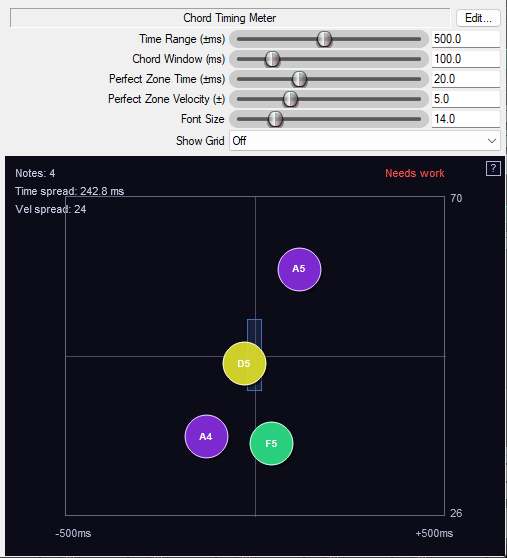

# Chord Timing Meter

**[chord-timing-meter.jsfx](../jsfx/chord-timing-meter.jsfx)**

A practice tool for pianists and keyboard players to visualize how accurately you play chords. When you play a chord (2+ notes close together), each note appears as a colored circle on a 2D plot showing its timing and velocity relative to the other notes.

## Parameters

- **Time Range (±ms)** (50-500): Horizontal scale for timing display
- **Chord Window (ms)** (10-200): Maximum gap between notes to be considered part of the same chord
- **Perfect Zone Time (±ms)** (5-50): Target timing tolerance for "perfect" rating
- **Perfect Zone Velocity (±)** (1-15): Target velocity tolerance for "perfect" rating
- **Display Duration (ms)** (500-10000): How long results stay visible after playing
- **Show Grid** (Off/On): Toggle background grid lines

## How It Works

- **Horizontal axis**: Shows timing differences in milliseconds. Notes played earlier appear left, later notes appear right. Perfect simultaneity means all circles align vertically in the center.
- **Vertical axis**: Shows velocity (intensity) differences. Notes played harder appear higher, softer notes lower. Even pressure means all circles align horizontally in the center.
- **Perfect Zone**: A blue rectangle in the center shows the target area. When all notes land inside, you get a "PERFECT!" rating.
- **Color coding**: Each pitch class (C, C#, D, etc.) has a unique hue. Colors shift toward blue when timing is good, toward red when timing is poor.
- **Quality feedback**: Displays "PERFECT!", "Good", "Fair", or "Needs work" based on timing and velocity spread.

## Use Cases

- **Technique practice**: Identify if you're consistently rolling chords or hitting some fingers earlier than others
- **Velocity control**: See if you're applying even pressure across all fingers
- **Chord voicing**: Intentionally practice playing certain notes louder while keeping timing tight
- **Progress tracking**: Watch your spread numbers decrease as your technique improves

## Technical Notes

- Detects chords as clusters of 2-10 notes played within the Chord Window time
- Displays note names with octave (e.g., C4, G#5) inside each circle
- All MIDI data passes through unchanged - place before your instrument
- Works with any MIDI source (keyboard, sequencer, etc.)

## Screenshots

Poor timing (190ms spread):

Good timing (3.3ms spread):

