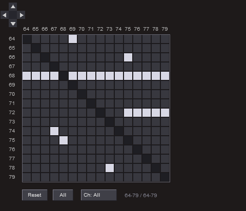

# MIDI Choke Matrix

**[midi-choke-matrix.jsfx](../jsfx/midi-choke-matrix.jsfx)**

A MIDI utility that lets you define which notes silence (choke) other notes via a 128x128 configurable matrix. When a note-on is received, the plugin sends note-offs for any active notes marked in that note's row.

## How It Works

The plugin maintains a 128x128 matrix where:
- **Rows** = the note being played (the "choker")
- **Columns** = the note to silence (the "choked")

When note 36 arrives and the cell at row 36, column 42 is active, the plugin sends a note-off for note 42 (if currently sounding) before passing through note 36.

Choke relationships are one-directional. If 36 chokes 42, that doesn't mean 42 chokes 36 - you need to set both cells for mutual choking.

## User Interface

- **D-pad navigation**: Arrow buttons in the top-left move the 16x16 viewport in 16-note chunks
- **Grid cells**: Click to toggle individual choke relationships
- **Row/column labels**: Click a number to toggle the entire row or column
  - If any cell is off → all turn on
  - If all cells are on → all turn off
- **Diagonal cells**: Greyed out (a note choking itself is meaningless)
- **Active note highlighting**: Labels turn cyan when that note is currently sounding

## Controls

- **Reset**: Clear the entire matrix (no chokes)
- **All**: Fill the entire matrix (every note chokes every other note)
- **Ch**: Channel selector - process all channels or a specific channel (1-16)

## Use Cases

- **Drum kits**: Closed hi-hat chokes open hi-hat, preventing overlapping sustains
- **Monophonic behavior**: Make a range of notes behave monophonically while leaving others polyphonic
- **Sample management**: Ensure certain samples never overlap (e.g., different snare articulations)
- **Creative effects**: Use selective choking to create rhythmic gating effects

## Technical Notes

- Choke relationships are stored as a 128x128 bit matrix (512 integers)
- Active notes are tracked per MIDI channel
- All non-note MIDI messages pass through unchanged
- Matrix and view state persist with the project via serialization

## Screenshot

